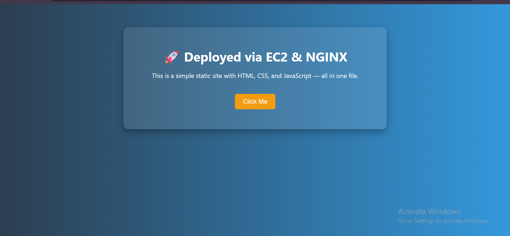

# Ngnix-web-application-on-AWS-EC2


This project demonstrates how to host a static website using **Amazon EC2** and **NGINX**. It walks through the steps of creating an instance, configuring security groups, installing NGINX, and deploying a static HTML page.

---

---

## 🛠️ Steps Followed

### 1. 🔧 Create EC2 Instance

- Launched an EC2 instance using **Amazon Linux 2023**.
- Selected **t2.micro** instance (Free Tier eligible).
- Used default settings with a custom security group.

📸 Screenshot:


---

### 2. 📡 Configure Security Group

To allow traffic to reach the server, I added the following **inbound rules**:

| Type | Protocol | Port Range | Source     |
|------|----------|------------|------------|
| SSH  | TCP      | 22         | 0.0.0.0/0  |
| HTTP | TCP      | 80         | 0.0.0.0/0  |

📸 Screenshot:


---

### 3. 🔗 Check Instance Status

After launching, verified the instance was **running** with a public IP assigned.

📸 Screenshot:


---

### 4. 🧰 Install and Configure NGINX

- Installed NGINX via YUM.
- Enabled and started the NGINX service.
- Verified it was running correctly.

📸 Screenshot:
  

## 🖼️ Project Preview


Commands used:
```bash
sudo yum install nginx -y
sudo systemctl start nginx
sudo systemctl enable nginx
sudo systemctl status nginx


#Example code

<!DOCTYPE html>
<html lang="en">
<head>
  <meta charset="UTF-8">
  <title>Welcome to EC2 Website</title>
  <style>
    body {
      font-family: 'Segoe UI', sans-serif;
      background: linear-gradient(to right, #2c3e50, #3498db);
      color: white;
      text-align: center;
      padding: 50px;
    }

    .container {
      max-width: 600px;
      margin: auto;
      background: rgba(255, 255, 255, 0.1);
      border-radius: 12px;
      padding: 30px;
      box-shadow: 0 8px 20px rgba(0, 0, 0, 0.3);
    }

    h1 {
      margin-bottom: 10px;
    }

    button {
      margin-top: 20px;
      padding: 10px 20px;
      background: #f39c12;
      border: none;
      border-radius: 5px;
      color: white;
      font-size: 16px;
      cursor: pointer;
      transition: background 0.3s ease;
    }

    button:hover {
      background: #e67e22;
    }

    #output {
      margin-top: 20px;
      font-size: 18px;
      color: #ecf0f1;
    }
  </style>
</head>
<body>
  <div class="container">
    <h1>🚀 Deployed via EC2 & NGINX</h1>
    <p>This is a simple static site with HTML, CSS, and JavaScript — all in one file.</p>
    
    <button onclick="showMessage()">Click Me</button>
    <div id="output"></div>
  </div>

  <script>
    function showMessage() {
      const messages = [
        "Hello from your EC2 server!",
        "NGINX is serving this file.",
        "AWS makes deployment easy!",
        "HTML + CSS + JS in one file!",
        "You just clicked the button 🚀"
      ];
      const msg = messages[Math.floor(Math.random() * messages.length)];
      document.getElementById('output').innerText = msg;
    }
  </script>
</body>
</html>


## Final Output

