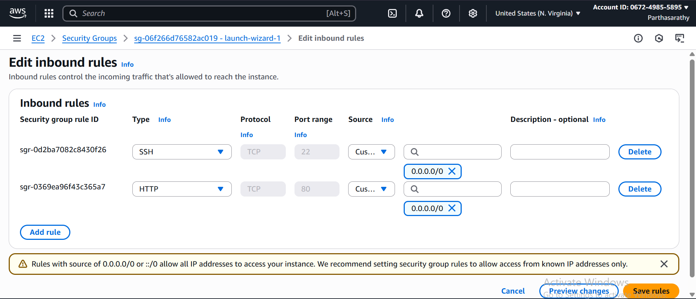
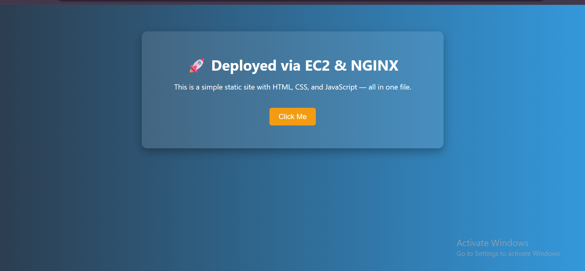

# Ngnix-web-application-on-AWS-EC2


## 👨‍💻 Author: Parthasarathy (Cloud Engineer)

This project demonstrates how to host a static website using **Amazon EC2** and **NGINX**. It walks through the steps of creating an instance, configuring security groups, installing NGINX, and deploying a static HTML page.

---

---

## 🛠️ Steps Followed

### 1. 🔧 Create EC2 Instance

- Launched an EC2 instance using **Amazon Linux 2023**.
- Selected **t2.micro** instance (Free Tier eligible).
- Used default settings with a custom security group.

📸 Screenshot:


---

### 2. 📡 Configure Security Group

To allow traffic to reach the server, I added the following **inbound rules**:

| Type | Protocol | Port Range | Source     |
|------|----------|------------|------------|
| SSH  | TCP      | 22         | 0.0.0.0/0  |
| HTTP | TCP      | 80         | 0.0.0.0/0  |

📸 Screenshot:


---

### 3. 🔗 Check Instance Status

After launching, verified the instance was **running** with a public IP assigned.

📸 Screenshot:


---

### 4. 🧰 Install and Configure NGINX

- Installed NGINX via YUM.
- Enabled and started the NGINX service.
- Verified it was running correctly.

📸 Screenshot:
  

## 🖼️ Project Preview




Commands used:
```bash
sudo yum install nginx -y
sudo systemctl start nginx
sudo systemctl enable nginx
sudo systemctl status nginx

